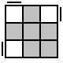
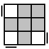
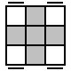
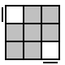

1. 校准正方向（白色为底）

2. 底面cross 
   对于每一个棱块情况如下：
   
   - 已还原$(x,y,z)= (1, 2, 0)$ whiteDirect = 'down'
   
   - 底面其他位置 $y = 2\to$移动到顶层
   
   - 顶层 $y = 0\to$ $(x, y, z) = (1, 0, 0)$
     
     - 白色指向侧面 whiteDirect = 'face'
     
     - 白色指向顶面 whiteDirect = 'up'
   
   - 中间位置 $(y=1)\to$移动到顶层
     
     - $(x, z) = (0, 0)$
     
     - $(x,z)=(0,2)$
     
     - $(x,z)= (2,0)$
     
     - $(x,z)=(2,2)$

3. 底层corner
   对于每一个角块块情况如下：
   
   - 已还原$(x, y, z) = (2, 2, 0)$ whiteDirect = 'down'
   
   - 底层其他位置$y=2\to$移动到顶层
   
   - 顶层 $y=0\to(x, y, z) = (2, 0, 0)$
     
     - 白色指向正面 whiteDirect = 'face'
     
     - 白色指向侧面 whiteDirect = 'right'
     
     - 白色指向顶面 whiteDirect = 'up'

4. Middle Layer
   对于每一个棱块情况如下
   
   - 已还原$(x, y, z) = (2, 1, 0) $ TargetColor_Direct = 'face'
   
   - 中间层其他位置$y = 1\to$移动到顶层正面
     
     - $(x, z) = (0, 0)\to$ y' + 公式1 + yU
     
     - $(x, z) = (2, 0)\to$ 公式1 + UU
     
     - $(x, z) = (2, 2)\to$ y + 公式1 + y'U'
     
     - $(x, z) = (0, 2)\to$ yy + 公式1 + yy
   
   - 顶层位置$y = 0\to$移动到正面
     
     - $(x, z) = (1, 2)\to$ UU
     
     - $(x, z) = (2, 1)\to$ U
     
     - $(x, z) = (0, 1)\to$ U'
   
   - TargetColor_Direct = 'face' $\to$ *algorithm1*
     TargetColor_direct = 'up' $\to$ *algorithm2*

5. Top Cross
   记录Longitudinal, Transverse 
   
   - 十字：$L = T = 0$
   
   - 一字：   
     
     - $\left\{\begin{matrix} L=2 \\ T=0 \end{matrix}\right.\to$ *algorithm1*
     
     - $\left\{\begin{matrix} L=0 \\ T=2 \end{matrix}\right.\to$ U + *algorithm1*
   
   - 直角：  $L=T=1$ 
     
     - left + face：U + *algorithm2*
     
     - face + right: UU + *algorithm2*
     
     - right + back: U' + *algorithm2*
     
     - back + left: *algorithm2*
   
   - 点：$L=T=2\to$ *algorithm2* + U + *algorithm1*

6. oll：
   每个角块的位置
   
   - $(x, z) = (2, 0)\to$ MainDirect: yellowDirect == 'face' ? face : right
   - $(x, z) = (2, 2)\to$ MainDirect: yellowDirect == 'right' ? face : right
   - $(x, z) = (0, 2)\to$ MainDirect: yellowDirect == 'back' ? face : right
   - $(x, z) = (0, 0)\to$ MainDirect: yellowDirect == 'left' ? face : right
   
   组合情况
   
   - $u=1$ (鱼)
     
     - oll1: $f = 3\to $ R' U2 R U R' U R
       
     
     - oll2: $r = 3\to$ R U' U' R' U' R U' R'
       
   
   - $u=0$
     
     - oll3: 存在$D_i = D_{(i+1) \mod 4} \to$ R U'U' R2' U' R2 U' R2' U2 R
       
     
     - oll4: 任意$D_i \neq D_{(i+1) \mod 4} \to$ R U U R' U' R U R' U' R U' R'
       
   
   - $u=2$
     
     - oll5: 当$D_i=f()$时，
       有$D_{(i+3) \mod 4}=r()\to$ R2 D' R U'U' R' D R U'U' R
       
     
     - oll6: 当$D_i=f()$时，
       有$D_{(i+2) \mod 4}=r()\to$ F' r U R' U' r' F R 
       
     
     - oll7: 当$D_i=f()$时，
       有$D_{(i+1) \mod 4}=r()\to$ r U R' U' r' F R F'
       

7. Change Prisms
   
   - 已还原
     $(D_1, D_2, D_3) = (right, back, left)$
   
   - 相邻换
     $(D_1, D_2, D_3) = (right, left, back)$
     F(R U'R' U')(R U R' F')(R U R' U')(R' F R F')
   
   - 逆时针三棱换
     $(D_1, D_2, D_3) = (left, right, back)$
     (R U' R) U (R U R U') (R' U' R2)
   
   - 对棱换
     $(D_1, D_2, D_3) = (left, back, right)$
     (R U R' U')(R' F R2 U' R' U')(R U R' F')
   
   - 顺时针三棱换
     $(D_1, D_2, D_3) = (back, left, right)$
     
     (R2' U)(R U R' U')(R' U')(R' U R')
   
   - 相邻换
     $(D_1, D_2, D_3) = (back, right, left)$
     U'F(R U'R' U')(R U R' F')(R U R' U')(R' F R F')
